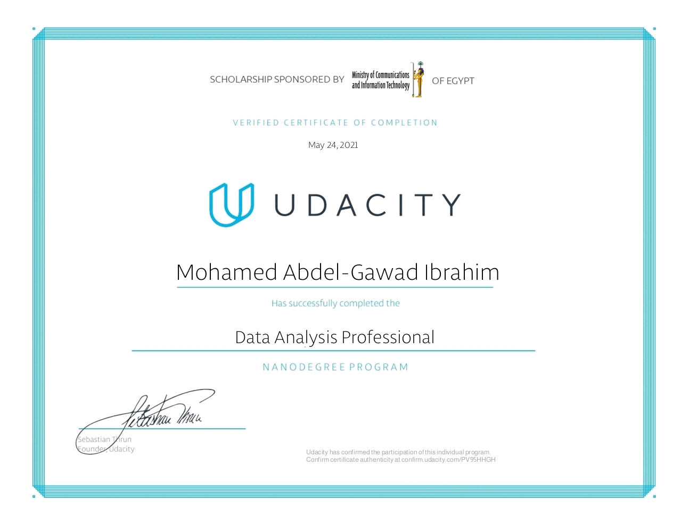

# Data Analysis Professional Nanodegree by Udacity

## Overview

This project includes two data analysis projects that I practiced during my study of the Data Analysis Professional Nanodegree by Udacity.

Even though the two projects were case studies and discussed in the classroom, I coded these projects by myself as a practice.

## Case Studies Projects:

* Exploring The Rotten Tomatoes Top 100 Movies of All Time

* Investigating Chemical Properties and Quality of Wine

## Certification

After nearly two months of hard studying, I completed the following projects:

* [Explore US Bikeshare Data](https://github.com/m-abdelgawad/explore-US-bikeshare-data) 

* [Investigate European Soccer Database](https://github.com/m-abdelgawad/investigate-european-soccer-database)  

And received my nanodegree certificate:

## About The Author

* Author: Mohamed Abdel-Gawad Ibrahim
* Contact: muhammadabdelgawwad@gmail.com
* Phone: +201069052620 || +201147821232